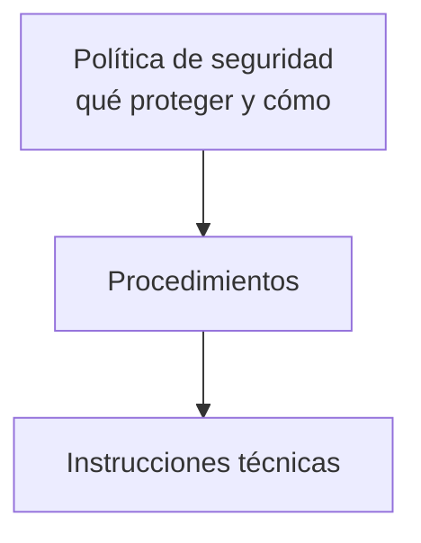

---
{"dg-publish":true,"permalink":"/bastionado-de-redes-y-sistemas/unidad-1-diseno-de-planes-de-securizacion/apuntes/5-politicas-de-securizacion/","tags":["asignatura/bastionado-de-redes-y-sistemas","politicas-de-seguridad"],"dgShowToc":true,"noteIcon":"","dg-note-properties":{"tipo":"apunte","asignatura":"Bastionado de redes y sistemas","tema":1,"apartado":"5","tags":["asignatura/bastionado-de-redes-y-sistemas","politicas-de-seguridad"]}}
---

# 5. Políticas de securización

## 5.1 Concepto de política de seguridad

Las **políticas de seguridad informática** son un conjunto de **normas y directrices** que permiten garantizar la **confidencialidad, integridad y disponibilidad** de la información y minimizar los riesgos que le afectan.

- Se define a **alto nivel**: *qué* se debe proteger y *cómo*, es decir, el conjunto de **controles** a implementar.
- Se desarrolla en **procedimientos** e **instrucciones técnicas** con las medidas técnicas y organizativas para cumplirla (ver [[Bastionado de redes y sistemas/Unidad 1 Diseño de planes de securización/Apuntes/8. Procedimientos, instrucciones y recomendaciones\|8. Procedimientos, instrucciones y recomendaciones]]).
- Debe basarse en un **análisis previo de riesgos** ([[Bastionado de redes y sistemas/Unidad 1 Diseño de planes de securización/Apuntes/2. Análisis de riesgos\|2. Análisis de riesgos]]) e incluir todos los procesos, sistemas y personal.
- Debe estar **aprobada por la dirección** y **comunicada a todo el personal**.

## 5.2 Cuerpo normativo de seguridad

### 5.2.1 Buenas prácticas

Documento específico, cláusulas anexas a los contratos, etc., que recoge entre otras cosas:

- El **uso aceptable** de sistemas e información por el personal.
- Directrices de **puesto de trabajo despejado**.
- **Bloqueo del equipo desatendido**.
- Protección de **contraseñas**.

### 5.2.2 Procedimiento de control de accesos

Recoge las medidas técnicas y organizativas sobre los permisos de acceso a instalaciones y sistemas y a la propia información. Los controles pueden ser:

- **Controles de acceso físico:** controlan el acceso de personas a las instalaciones: tornos, barreras, cámaras, alarmas, apertura biométrica o por tarjeta, armarios cerrados con llave… cualquier medio físico que impida el acceso no autorizado.
- **Controles de acceso lógico:** controlan el acceso de usuarios a sistemas e información: **NAC** (control de acceso de equipos y usuarios a la red), permisos de lectura/escritura sobre archivos, sistemas de *login*, autorización de acceso remoto por **VPN**, etc.

Ver [[Bastionado de redes y sistemas/Unidad 2 Control de acceso y autenticación/Apuntes/5. Control de acceso\|UD2-5. Control de acceso]] y [[Bastionado de redes y sistemas/Unidad 3 Administración de credenciales de acceso/Apuntes/5. Gestión de accesos. Sistemas NAC\|UD3-5. Gestión de accesos. Sistemas NAC]].

### 5.2.3 Procedimiento de gestión de usuarios

Instrucciones para el **alta**, **cambio de puesto** y **baja** (voluntaria o cese) de usuarios en los sistemas, y para conceder los permisos físicos y lógicos correspondientes.

> [!important] Mínimo privilegio
> Se basa en una definición clara de **roles y responsabilidades**: a cada persona se le conceden los accesos y permisos **mínimos y necesarios** para su trabajo.

### 5.2.4 Procedimiento de clasificación y tratamiento de la información

Cómo **clasificar** la información según su valor, requisitos legales, sensibilidad y criticidad, y qué medidas de protección y manipulación aplicar según su clasificación.

### 5.2.5 Procedimiento de gestión de incidentes de seguridad

Instrucciones para la **notificación** de incidentes y la **respuesta** (acciones a realizar al detectarlos). Ver [[Bastionado de redes y sistemas/Unidad 1 Diseño de planes de securización/Apuntes/9. Atención a incidencias\|9. Atención a incidencias]].

### 5.2.6 Otros procedimientos

- Gestión de activos de información.
- Copias de seguridad.
- Seguridad de la red.
- *Anti-malware*.
- Registro y supervisión de eventos.
- Actualización y parcheo de sistemas y equipos.

> [!note] Resumen
> Las políticas deben **adaptarse a las necesidades** de la organización y, en la medida de lo posible, ser **atemporales**. Por ello cobra importancia el rol del **experto en ciberseguridad** dentro de las organizaciones.

> [!example] Actividad 1
> Redacta, para una pyme, un breve procedimiento de gestión de usuarios que cubra alta, cambio de puesto y baja, indicando qué permisos físicos y lógicos se conceden o retiran en cada caso.

> [!quote]- Fuentes
> - `Bloque 1-Diseño de Planes de Securización.pdf` (apartado 4, págs. 18-20)

🡠 [[Bastionado de redes y sistemas/Unidad 1 Diseño de planes de securización/Apuntes/4. Plan de medidas técnicas de seguridad\|4. Plan de medidas técnicas de seguridad]] ⮅ [[Bastionado de redes y sistemas/Unidad 1 Diseño de planes de securización/Apuntes/5. Políticas de securización#5. Políticas de securización\|#5. Políticas de securización]] 🡢 [[Bastionado de redes y sistemas/Unidad 1 Diseño de planes de securización/Apuntes/6. Guía de buenas prácticas de securización\|6. Guía de buenas prácticas de securización]]
