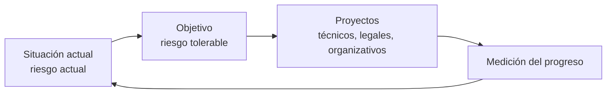

---
{"dg-publish":true,"permalink":"/bastionado-de-redes-y-sistemas/unidad-1-diseno-de-planes-de-securizacion/apuntes/8-procedimientos-instrucciones-y-recomendaciones/","tags":["asignatura/bastionado-de-redes-y-sistemas","plan-director-de-seguridad"],"dgShowToc":true,"noteIcon":"","dg-note-properties":{"tipo":"apunte","asignatura":"Bastionado de redes y sistemas","tema":1,"apartado":"8","tags":["asignatura/bastionado-de-redes-y-sistemas","plan-director-de-seguridad"]}}
---

# 8. Procedimientos, instrucciones y recomendaciones

## 8.1 Política, procedimientos e instrucciones

Como se vio en [[Bastionado de redes y sistemas/Unidad 1 Diseño de planes de securización/Apuntes/5. Políticas de securización\|5. Políticas de securización]], el cuerpo normativo de seguridad se organiza en niveles:

- **Política:** define a alto nivel *qué* proteger y *cómo* (controles). Aprobada por la dirección.
- **Procedimientos:** desarrollan la política recogiendo las medidas técnicas y organizativas (control de accesos, gestión de usuarios, clasificación de la información, gestión de incidentes, copias de seguridad…).
- **Instrucciones técnicas:** concretan cómo aplicar esas medidas.
- **Recomendaciones / buenas prácticas:** pautas de comportamiento para el personal (ver [[Bastionado de redes y sistemas/Unidad 1 Diseño de planes de securización/Apuntes/6. Guía de buenas prácticas de securización\|6. Guía de buenas prácticas de securización]]).

> [!info] Contenido complementario (fuente externa)
> Los apuntes del módulo no detallan cada tipo de documento. Esta caracterización sigue el **ENS** ([RD 311/2022](https://www.boe.es/buscar/act.php?id=BOE-A-2022-7191): art. 12, anexo II medidas org.1–org.3 y disposición adicional 2ª) y la guía [CCN-STIC 801](https://www.aec.es/wp-media/uploads/DPD-00269.SEG-GUI-007-801_ENS-responsabilidades.pdf). Estos documentos forman una **pirámide**: cuanto más abajo, más concreto y técnico es el documento y más a menudo cambia.
>
> | Nivel | Qué es | Obligatoriedad | Contenido mínimo | Quién lo aprueba | Ejemplo |
> | --- | --- | :-: | --- | --- | --- |
> | **Política** (org.1) | Conjunto de directrices que rigen cómo la organización gestiona y protege su información y servicios. | Obligatoria para toda la organización | Misión u objetivos, marco legal, roles de seguridad y cómo se designan, comités, directrices para estructurar la documentación, riesgos derivados de los datos personales. | La **Dirección** (el órgano superior o, en el sector privado, quien tenga las máximas competencias ejecutivas). | Política de Seguridad de la Información. |
> | **Normativa** (org.2) | Reglas de uso: qué está permitido y qué no. | Obligatoria para el personal | Uso correcto e indebido de equipos, servicios e instalaciones; responsabilidades del personal, derechos, deberes y medidas disciplinarias. | El **Comité de Seguridad de la Información** (CCN-STIC 801). | Normativa de uso del correo y de Internet. |
> | **Procedimientos** (org.3) | Describen de forma clara y precisa **cómo** manejar el sistema de información. | Obligatorios para quien ejecuta la tarea | Cómo hacer las tareas habituales, quién hace cada una, cómo detectar y comunicar anomalías, cómo tratar la información según su nivel (acceso, almacenamiento, copias, etiquetado, transmisión). | Deben ser **validados por la autoridad correspondiente** (refuerzo org.3.r1). | Procedimiento de altas y bajas de usuarios o de copias de seguridad. |
> | **Instrucciones técnicas / guías** | Detalle técnico paso a paso: configuraciones, *checklists*. | Según el caso | Parámetros y pasos concretos para un producto o un entorno. | En el ENS, las **ITS** (instrucciones técnicas de seguridad) son **de obligado cumplimiento** y las aprueba el Ministerio; las **guías CCN-STIC** las publica el CCN como apoyo. | ITS de notificación de incidentes; guía CCN-STIC de bastionado de Windows. |
> | **Recomendaciones / buenas prácticas** | Consejos que orientan la conducta. | **No obligatorias** (orientativas) | Pautas de comportamiento seguro. | — | Guía de buenas prácticas para el empleado. |
>
> - **Diferencia clave:** la **política** dice *qué* se quiere conseguir, la **normativa** marca lo que se *puede y no se puede* hacer, y el **procedimiento** explica *cómo* se hace y *quién* lo hace.
> - En una pyme, INCIBE propone [políticas de seguridad](https://www.incibe.es/empresas/herramientas/politicas) con *checklists* separadas según su destinatario: **empresario**, **personal técnico** y **empleados**.
> - La norma **ISO/IEC 27001** también exige una política aprobada por la alta dirección y el control de la "información documentada" (conocimiento general, verificar).

## 8.2 Plan Director de Seguridad

¿Por dónde empezar? Para abordar la ciberseguridad hay que **planificar** las actividades y contar con el **compromiso de la dirección**. A esa planificación se le llama **Plan Director de Seguridad (PDS)**:

- Marca las **prioridades**, los **responsables** y los **recursos** para mejorar el nivel de seguridad.
- Contiene **proyectos técnicos, legales y organizativos**:
  - Técnicos: instalación de productos o contratación de servicios.
  - Legales: cumplimiento de las leyes de privacidad y comercio electrónico.
  - Organizativos: formación de empleados, puesta en marcha de procedimientos y políticas internas.
- Contempla, entre otras, la **política de copias de seguridad** de la organización (ver [[Bastionado de redes y sistemas/Unidad 7 Configuración de sistemas informáticos/Apuntes/8. Sistemas de copias de seguridad\|8. Sistemas de copias de seguridad]]).

### 8.2.1 Punto de partida y objetivo

Cada empresa es un mundo, así que:

1. Se calcula el **nivel de seguridad actual** (punto de partida), evaluando el **riesgo que nos afecta** y el que **podemos tolerar** (ver [[Bastionado de redes y sistemas/Unidad 1 Diseño de planes de securización/Apuntes/2. Análisis de riesgos\|2. Análisis de riesgos]]).
2. Se fija un **objetivo** de dónde queremos estar, **alineado con la estrategia de negocio**: qué vamos a proteger, cómo haremos la prevención, qué incidentes podemos tener, cómo nos preparamos para reaccionar…
3. Para el riesgo no tolerable se definen **proyectos** con medidas, a nuestro ritmo.
4. Se **mide el progreso** del plan de forma continua.

### 8.2.2 PDS y Plan de Contingencia

Toda empresa que proteja sus sistemas contará con un **Plan Director de Seguridad** y un **Plan de Contingencia y Continuidad de Negocio**:

- **PDS:** prioridades, responsables y recursos para mejorar la seguridad.
- **Plan de Contingencia y Continuidad:** pautas para responder rápida y eficazmente a un incidente y **restablecer la actividad** lo antes posible, reduciendo el impacto.

> [!info] Contenido complementario (fuente externa)
> Según el dosier de INCIBE, el PDS se elabora en **seis fases**:
> 1. **Conocer la situación actual** de la organización (la fase más importante y compleja: análisis técnico, de riesgos y de cumplimiento).
> 2. **Conocer la estrategia** de la organización (alinear el plan con los objetivos de negocio).
> 3. **Definir proyectos e iniciativas.**
> 4. **Clasificar y priorizar** los proyectos (según coste, esfuerzo y beneficio).
> 5. **Aprobar** el Plan Director de Seguridad (dirección).
> 6. **Puesta en marcha.**
>
> Fuentes: [INCIBE – Plan Director de Seguridad](https://www.incibe.es/empresas/que-te-interesa/plan-director-seguridad) · [Dosier PDF](https://www.incibe.es/sites/default/files/contenidos/dosieres/metad_plan-director-seguridad.pdf)

> [!example] Actividad 1
> Elabora un pequeño Plan Director de Seguridad para la pyme analizada en [[Bastionado de redes y sistemas/Unidad 1 Diseño de planes de securización/Apuntes/2. Análisis de riesgos\|2. Análisis de riesgos]], indicando la situación actual, el objetivo y al menos tres proyectos (uno técnico, uno legal y uno organizativo) con su prioridad y responsable.

> [!quote]- Fuentes
> - `Bloque 1-Diseño de Planes de Securización.pdf` (apartados 4 y 7, págs. 18 y 31-32)
> - `UT 7- Confiiguración de SI.pdf` (copias de seguridad: PDS y Plan de Contingencia, pág. 34)
> - `Bloque 1-Prácticas-1.pdf` (práctica 4)
> - Externas (8.1): [RD 311/2022 – ENS (BOE)](https://www.boe.es/buscar/act.php?id=BOE-A-2022-7191) · [CCN-STIC 801](https://www.aec.es/wp-media/uploads/DPD-00269.SEG-GUI-007-801_ENS-responsabilidades.pdf) · [INCIBE – Políticas de seguridad para la pyme](https://www.incibe.es/empresas/herramientas/politicas)

🡠 [[Bastionado de redes y sistemas/Unidad 1 Diseño de planes de securización/Apuntes/7. Estándares de securización\|7. Estándares de securización]] ⮅ [[Bastionado de redes y sistemas/Unidad 1 Diseño de planes de securización/Apuntes/8. Procedimientos, instrucciones y recomendaciones#8. Procedimientos, instrucciones y recomendaciones\|#8. Procedimientos, instrucciones y recomendaciones]] 🡢 [[Bastionado de redes y sistemas/Unidad 1 Diseño de planes de securización/Apuntes/9. Atención a incidencias\|9. Atención a incidencias]]
