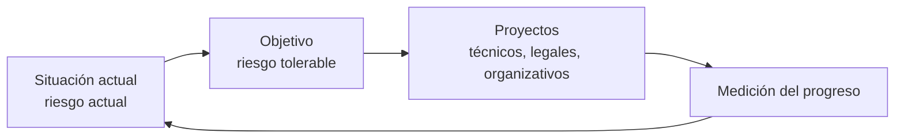

---
{"dg-publish":true,"permalink":"/bastionado-de-redes-y-sistemas/unidad-1-diseno-de-planes-de-securizacion/apuntes/8-procedimientos-instrucciones-y-recomendaciones/","tags":["asignatura/bastionado-de-redes-y-sistemas","plan-director-de-seguridad"],"dgShowToc":true,"noteIcon":"","dg-note-properties":{"tipo":"apunte","asignatura":"Bastionado de redes y sistemas","tema":1,"apartado":"8","tags":["asignatura/bastionado-de-redes-y-sistemas","plan-director-de-seguridad"]}}
---

# 8. Procedimientos, instrucciones y recomendaciones

## 8.1 Política, procedimientos e instrucciones

Como se vio en [[Bastionado de redes y sistemas/Unidad 1 Diseño de planes de securización/Apuntes/5. Políticas de securización\|5. Políticas de securización]], el cuerpo normativo de seguridad se organiza en niveles:

- **Política:** define a alto nivel *qué* proteger y *cómo* (controles). Aprobada por la dirección.
- **Procedimientos:** desarrollan la política recogiendo las medidas técnicas y organizativas (control de accesos, gestión de usuarios, clasificación de la información, gestión de incidentes, copias de seguridad…).
- **Instrucciones técnicas:** concretan cómo aplicar esas medidas.
- **Recomendaciones / buenas prácticas:** pautas de comportamiento para el personal (ver [[Bastionado de redes y sistemas/Unidad 1 Diseño de planes de securización/Apuntes/6. Guía de buenas prácticas de securización\|6. Guía de buenas prácticas de securización]]).

> [!warning] Falta fuente: caracterización detallada de procedimientos, instrucciones y recomendaciones
> Las fuentes no desarrollan las características formales de cada tipo de documento (estructura, contenido mínimo, nivel de obligatoriedad). Solo tratan el Plan Director de Seguridad.

## 8.2 Plan Director de Seguridad

¿Por dónde empezar? Para abordar la ciberseguridad hay que **planificar** las actividades y contar con el **compromiso de la dirección**. A esa planificación se le llama **Plan Director de Seguridad (PDS)**:

- Marca las **prioridades**, los **responsables** y los **recursos** para mejorar el nivel de seguridad.
- Contiene **proyectos técnicos, legales y organizativos**:
  - Técnicos: instalación de productos o contratación de servicios.
  - Legales: cumplimiento de las leyes de privacidad y comercio electrónico.
  - Organizativos: formación de empleados, puesta en marcha de procedimientos y políticas internas.
- Contempla, entre otras, la **política de copias de seguridad** de la organización (ver [[8. Sistemas de copias de seguridad\|8. Sistemas de copias de seguridad]]).

### 8.2.1 Punto de partida y objetivo

Cada empresa es un mundo, así que:

1. Se calcula el **nivel de seguridad actual** (punto de partida), evaluando el **riesgo que nos afecta** y el que **podemos tolerar** (ver [[Bastionado de redes y sistemas/Unidad 1 Diseño de planes de securización/Apuntes/2. Análisis de riesgos\|2. Análisis de riesgos]]).
2. Se fija un **objetivo** de dónde queremos estar, **alineado con la estrategia de negocio**: qué vamos a proteger, cómo haremos la prevención, qué incidentes podemos tener, cómo nos preparamos para reaccionar…
3. Para el riesgo no tolerable se definen **proyectos** con medidas, a nuestro ritmo.
4. Se **mide el progreso** del plan de forma continua.

### 8.2.2 PDS y Plan de Contingencia

Toda empresa que proteja sus sistemas contará con un **Plan Director de Seguridad** y un **Plan de Contingencia y Continuidad de Negocio**:

- **PDS:** prioridades, responsables y recursos para mejorar la seguridad.
- **Plan de Contingencia y Continuidad:** pautas para responder rápida y eficazmente a un incidente y **restablecer la actividad** lo antes posible, reduciendo el impacto.

> [!warning] Falta fuente: fases del Plan Director de Seguridad
> La fuente remite al dosier de INCIBE para las fases detalladas del PDS, pero no las incluye. Recursos:
> - Vídeo y casos de éxito: https://www.incibe.es/protege-tu-empresa/que-te-interesa/plan-director-seguridad
> - Dosier: https://www.incibe.es/sites/default/files/contenidos/dosieres/metad_plan-director-seguridad.pdf

> [!example] Actividad 1
> Elabora un pequeño Plan Director de Seguridad para la pyme analizada en [[Bastionado de redes y sistemas/Unidad 1 Diseño de planes de securización/Apuntes/2. Análisis de riesgos\|2. Análisis de riesgos]], indicando la situación actual, el objetivo y al menos tres proyectos (uno técnico, uno legal y uno organizativo) con su prioridad y responsable.

> [!quote]- Fuentes
> - `Bloque 1-Diseño de Planes de Securización.pdf` (apartados 4 y 7, págs. 18 y 31-32)
> - `UT 7- Confiiguración de SI.pdf` (copias de seguridad: PDS y Plan de Contingencia, pág. 34)
> - `Bloque 1-Prácticas-1.pdf` (práctica 4)

🡠 [[Bastionado de redes y sistemas/Unidad 1 Diseño de planes de securización/Apuntes/7. Estándares de securización\|7. Estándares de securización]] ⮅ [[Bastionado de redes y sistemas/Unidad 1 Diseño de planes de securización/Apuntes/8. Procedimientos, instrucciones y recomendaciones#8. Procedimientos, instrucciones y recomendaciones\|#8. Procedimientos, instrucciones y recomendaciones]] 🡢 [[Bastionado de redes y sistemas/Unidad 1 Diseño de planes de securización/Apuntes/9. Atención a incidencias\|9. Atención a incidencias]]
