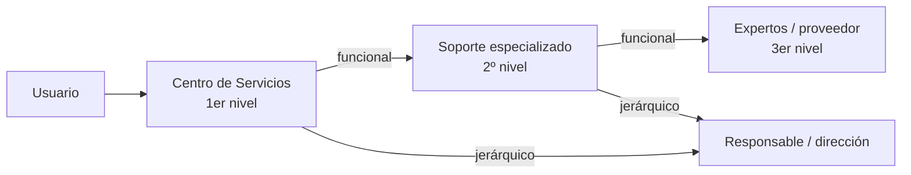

---
{"dg-publish":true,"permalink":"/bastionado-de-redes-y-sistemas/unidad-1-diseno-de-planes-de-securizacion/apuntes/9-atencion-a-incidencias/","tags":["asignatura/bastionado-de-redes-y-sistemas","gestion-de-incidencias"],"dgShowToc":true,"noteIcon":"","dg-note-properties":{"tipo":"apunte","asignatura":"Bastionado de redes y sistemas","tema":1,"apartado":"9","tags":["asignatura/bastionado-de-redes-y-sistemas","gestion-de-incidencias"]}}
---

# 9. Atención a incidencias

## 9.1 Clasificación y priorización

Es frecuente que haya **múltiples incidencias concurrentes**, por lo que hay que asignarles un **nivel de prioridad**. La priorización se basa en dos parámetros:

- **Impacto:** importancia de la incidencia según cómo afecta a los procesos de negocio y/o el número de usuarios afectados.
- **Urgencia:** tiempo máximo de demora que acepta el cliente para la resolución y/o nivel de servicio acordado en el **SLA** (*Service Level Agreement*).

También influyen factores auxiliares como el **tiempo de resolución esperado** y los **recursos necesarios**: los incidentes "sencillos" se tramitan cuanto antes. Según la prioridad se asignan los recursos.

> [!note] La prioridad puede cambiar
> Durante el ciclo de vida del incidente la prioridad puede variar; p. ej., una **solución temporal** que restaure aceptablemente el servicio permite retrasar el cierre sin graves repercusiones.

Conviene establecer un protocolo para fijar la prioridad inicial mediante un **diagrama (matriz) de prioridades** en función de impacto y urgencia:

| Impacto \ Urgencia | Alta | Media | Baja |
| :-: | :-: | :-: | :-: |
| **Alto** | Crítica | Alta | Media |
| **Medio** | Alta | Media | Baja |
| **Bajo** | Media | Baja | Planificada |

> [!warning] Ejemplo orientativo
> La fuente muestra un diagrama de prioridades como imagen; los valores de esta tabla son un ejemplo típico (conocimiento general, verificar).

## 9.2 Escalado y soporte

Cuando el **Centro de Servicios** no puede resolver un incidente en primera instancia, recurre a un especialista o a un superior con capacidad de decisión. Este proceso se llama **escalado**. Tipos:

- **Escalado funcional:** se necesita un **especialista de más alto nivel** técnico para resolver la incidencia.
- **Escalado jerárquico:** se acude a un **responsable de mayor autoridad** para tomar decisiones que exceden las atribuciones del nivel actual (p. ej., asignar más recursos).

> [!tip] Tamaño de la organización
> En grandes organizaciones el escalado puede incluir **más niveles**; en las **pymes** se pueden **integrar** varios niveles.

## 9.3 Proceso de atención de incidencias

### 9.3.1 Registro

- Primer paso necesario. Las incidencias pueden venir de usuarios, gestión de aplicaciones, el propio Centro de Servicios o soporte técnico.
- Debe hacerse **inmediatamente**: hacerlo después es más costoso y las nuevas incidencias pueden retrasarlo indefinidamente.

### 9.3.2 Clasificación

Su objetivo es recopilar toda la información útil para la resolución. Pasos mínimos:

1. **Categorización:** según el tipo de incidente o el grupo responsable.
2. **Nivel de prioridad:** según impacto y urgencia, con criterios preestablecidos.
3. **Asignación de recursos:** si el Centro de Servicios no puede resolverlo, designa al personal de soporte.
4. **Monitorización** del estado y del tiempo de respuesta esperado.

### 9.3.3 Análisis, resolución y cierre

- Se comprueba si coincide con una incidencia **ya resuelta** y se aplica su procedimiento.
- Si excede al Centro de Servicios, se redirige a un **nivel superior**; si los expertos no lo resuelven, se siguen los **protocolos de escalado**.
- Durante todo el ciclo se **actualiza la información** en las bases de datos.
- Al solucionarlo:
  - Se **confirma** con los usuarios la solución.
  - Se **incorpora** el proceso de resolución a la incidencia.
  - Se **reclasifica** si es necesario.
  - Se actualiza la BD de **elementos de configuración** implicados.
  - Se **cierra** el incidente.

## 9.4 Control del proceso

### 9.4.1 Informes

Los informes aportan información para:

- **Gestión de niveles de servicio:** informar del cumplimiento de los SLA y corregir incumplimientos.
- **Monitorizar el rendimiento del Centro de Servicios:** satisfacción del cliente y funcionamiento de la primera línea.
- **Optimizar la asignación de recursos:** comprobar que el escalado siguió los protocolos y sin duplicidades.
- **Identificar errores** en los protocolos.
- **Información estadística** para proyecciones de recursos y costes.

### 9.4.2 Infraestructura necesaria

- Sistema **automatizado de registro** de incidentes y relación con los clientes.
- **SKMS** (*Service Knowledge Management System*, Sistema de Gestión del Conocimiento del Servicio): compara nuevos incidentes con otros ya resueltos. Permite:
  - Evitar **escalados innecesarios**.
  - Convertir el *know how* de los técnicos en un **activo duradero**.
  - Ofrecer datos al cliente (FAQ en una extranet) para que a veces no necesite notificar la incidencia.
- **CMDB** (base de datos de gestión de la configuración): conocer las configuraciones actuales y su impacto en la resolución.

### 9.4.3 Métricas

- Número de incidentes por periodo y prioridad.
- Tiempos de resolución según impacto y urgencia.
- Nivel de cumplimiento del **SLA**.
- Costes asociados.
- Uso de los recursos del Centro de Servicios.
- Porcentaje de incidentes resueltos en **primera instancia**, por prioridad.
- Grado de satisfacción del cliente.

Ver también [[15. Centros de operaciones NOC y SOC\|15. Centros de operaciones NOC y SOC]].

> [!example] Actividad 1
> Un servidor de correo de la empresa deja de funcionar a las 9:00 y afecta a toda la plantilla. Indica su impacto, urgencia y prioridad, y describe qué tipo de escalado se produciría si el técnico de primer nivel necesita contratar soporte externo urgente.

> [!quote]- Fuentes
> - `Bloque 1-Diseño de Planes de Securización.pdf` (apartado 8, págs. 32-36)

🡠 [[Bastionado de redes y sistemas/Unidad 1 Diseño de planes de securización/Apuntes/8. Procedimientos, instrucciones y recomendaciones\|8. Procedimientos, instrucciones y recomendaciones]] ⮅ [[Bastionado de redes y sistemas/Unidad 1 Diseño de planes de securización/Apuntes/9. Atención a incidencias#9. Atención a incidencias\|#9. Atención a incidencias]]
