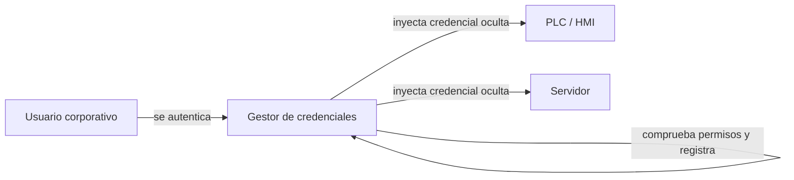

---
{"dg-publish":true,"permalink":"/bastionado-de-redes-y-sistemas/unidad-3-administracion-de-credenciales-de-acceso/apuntes/2-gestion-de-credenciales/","tags":["asignatura/bastionado-de-redes-y-sistemas","gestion-de-credenciales"],"dgShowToc":true,"noteIcon":"","dg-note-properties":{"tipo":"apunte","asignatura":"Bastionado de redes y sistemas","tema":3,"apartado":"2","tags":["asignatura/bastionado-de-redes-y-sistemas","gestion-de-credenciales"]}}
---

# 2. Gestión de credenciales

El acceso a los sistemas de control puede hacerse de muchas maneras:

- **Accesos locales:** los realiza normalmente el operador.
- **Accesos remotos internos:** por ejemplo, desde las estaciones de ingeniería.
- **Accesos desde el exterior:** cuando proveedores o fabricantes hacen tareas de mantenimiento.

La consecuencia es que las **credenciales** de los equipos quedan expuestas y pueden ser conocidas por demasiados actores; en muchos casos incluso se mantienen las **credenciales por defecto** "para facilitar la gestión".

## 2.1 Tipos de credenciales más utilizados

Una credencial es la prueba que presenta un usuario (persona, equipo o servicio) para demostrar su identidad. Según los factores de autenticación vistos en [[Bastionado de redes y sistemas/Unidad 2 Control de acceso y autenticación/Apuntes/3. Mecanismos y factores de autenticación\|UD2-3. Mecanismos y factores de autenticación]], las credenciales más habituales son:

- **Contraseñas y PIN** (algo que el usuario sabe): el tipo más extendido y también el más problemático (ver [[Bastionado de redes y sistemas/Unidad 3 Administración de credenciales de acceso/Apuntes/2. Gestión de credenciales#2.2 Problemas habituales con las credenciales\|#2.2 Problemas habituales con las credenciales]]).
- **Tókenes** (algo que el usuario tiene):
  - **Tókenes desconectados:** tarjetas de coordenadas o generadores de contraseñas de un solo uso (*OTP, One Time Password*), como el RSA SecurID.
  - **Tókenes conectados:** *smart cards*, tarjetas/etiquetas RFID y tókenes USB.
  - **Tókenes de software:** ficheros guardados en dispositivos de uso general (PC, móvil…), basados en un secreto compartido o en un sistema de clave pública.
- **Certificados digitales y pares de claves** (clave privada custodiada por el usuario): base de la [[Bastionado de redes y sistemas/Unidad 3 Administración de credenciales de acceso/Apuntes/3. Infraestructuras de clave pública (PKI)\|PKI]], de la [[Bastionado de redes y sistemas/Unidad 3 Administración de credenciales de acceso/Apuntes/4. Acceso mediante firma electrónica\|firma electrónica]] (DNI-e) y del acceso por claves en SSH.
- **Biometría** (algo que el usuario es): huella, reconocimiento facial, voz, iris…
- **Tickets de sesión:** credenciales temporales emitidas tras una autenticación, como los *tickets* de [[Bastionado de redes y sistemas/Unidad 3 Administración de credenciales de acceso/Apuntes/7. RADIUS, TACACS y Kerberos#7.3 Kerberos\|Kerberos]] (TGT/TGS).

> [!note]
> Según a quién pertenezcan, también se distingue entre **cuentas nominales**, **cuentas compartidas**, **cuentas de sistema** y **cuentas de servicio**. Se estudian en [[Bastionado de redes y sistemas/Unidad 3 Administración de credenciales de acceso/Apuntes/6. Gestión de cuentas privilegiadas#6.3 Ecosistema heterogéneo de cuentas privilegiadas\|el ecosistema de cuentas privilegiadas]].

## 2.2 Problemas habituales con las credenciales

La sencillez de las contraseñas es solo uno de los muchos problemas. Destacan:

- **Uso de contraseñas por defecto:** los dispositivos en ubicaciones remotas suelen conservar la contraseña de fábrica, de modo que los operadores acceden a todos con las mismas credenciales sin necesidad de saber dónde están.
- **Uso de contraseñas compartidas:** muchos dispositivos no admiten varios usuarios, o se comparten "por eficiencia" (equipos de mantenimiento o soporte). Esto **impide la trazabilidad** de las acciones y permite que un usuario siga conociendo las credenciales **después de dejar la empresa**.
- **Incremento del uso de credenciales:** cada vez más aplicaciones y usuarios necesitan credenciales, lo que implica más información de autenticación viajando por la red; si esta no está bien protegida, las credenciales pueden descubrirse.
- **Uso de credenciales privilegiadas:** el uso de cuentas de administrador para acceder a los componentes es cada vez mayor y llega a ser inmanejable, impidiendo la gestión y el seguimiento de las acciones. Las usan personal de mantenimiento, fabricantes, operadores, ingenieros de control, procesos automáticos y aplicaciones corporativas (ver [[Bastionado de redes y sistemas/Unidad 3 Administración de credenciales de acceso/Apuntes/6. Gestión de cuentas privilegiadas\|6. Gestión de cuentas privilegiadas]]).
- **Contraseñas embebidas:** el uso de equipos de propósito general (en lugar de equipos específicos) abarata costes y mejora la compatibilidad, pero aumenta las contraseñas incrustadas en el propio software. Esto incrementa el riesgo de compromiso y de accesos no autorizados a todo el sistema: manipulación de dispositivos, ejecución de código o **denegación de servicio**.

## 2.3 Mejoras y retos

Gestionar correctamente las credenciales en un sistema de control industrial tiene implicaciones tanto técnicas como económicas:

- **Incremento del riesgo de caída del sistema:** los equipos comerciales (HMI, servidores, estaciones de trabajo) son los mayores puntos de riesgo de las redes industriales; el segundo punto crítico son los equipos de conexión con la red empresarial. Ambos pueden verse afectados por el compromiso de credenciales privilegiadas.
- **Incremento de costes operacionales:** implantar controles sin preparación adecuada puede aumentar los tiempos de mantenimiento y gestión y dificultar el escalado.
- **Regulación y normativa:** las infraestructuras críticas deben demostrar su grado de cumplimiento ante la autoridad competente, por lo que las herramientas deben generar **indicadores** que ayuden en ese proceso.
- **Cuentas privilegiadas:** todos los dispositivos y programas tienen cuentas privilegiadas; el riesgo aparece cuando no se gestionan bien, las conocen demasiadas personas o no son suficientemente robustas.

Para afrontar estos problemas existen los **gestores de credenciales**. Se usan desde hace tiempo en entornos **TI** (Tecnologías de la Información), pero en entornos **TO** (Tecnologías de la Operación) se han empezado a implantar hace poco, sobre todo por la dificultad de gestionar **accesos de urgencia** que requieren autenticación inmediata para resolver un problema en el proceso.

> [!important] TI y TO
> Los mundos TI y TO han sido tradicionalmente independientes, pero sus necesidades y problemas son cada vez más comunes, y la experiencia de cada uno debería extenderse al otro.

## 2.4 Características de un gestor de credenciales

Una herramienta de gestión de credenciales para sistemas de control debe cubrir:

- **Descubrimiento de credenciales:** muchos sistemas no están bien inventariados. La herramienta debe reconocer y almacenar las credenciales que observe en la red o monitorizando equipos. Es la **fase inicial**, para cargar su base de datos de usuarios.
- **Ocultación de credenciales:** los usuarios no deberían conocer nunca las credenciales (al menos la contraseña). Así no hay que divulgarlas a fabricantes o mantenedores, ni cambiarlas al cambiar de empresa de mantenimiento, y se reducen las **amenazas internas** (empleados descontentos).
- **Rotación periódica de claves:** limita la validez temporal de las contraseñas. Debe hacerse de forma **automática y programable**, con más frecuencia de la habitual.
- **Registro de accesos:** debe registrar **qué usuario físico** ha usado las credenciales almacenadas, normalmente a través de su usuario corporativo en la herramienta.
- **Punto de acceso único:** todas las peticiones a cualquier dispositivo pasan por la herramienta, que comprueba si el usuario tiene acceso, introduce las credenciales con los privilegios adecuados y deriva al usuario ya autenticado.

## 2.5 Herramientas comerciales

El mercado no está muy orientado a sistemas de control, aunque hay soluciones específicas y otras de entornos TI con cierto soporte industrial (estas últimas suelen limitarse al descubrimiento de credenciales privilegiadas). Algunas opciones:

| Producto | Fabricante |
| :-: | :-: |
| Shared Account Password Management | Centrify |
| Privileged Password Manager | Quest |
| PowerBroker Password Safe | BeyondTrust |
| CyberArk Privileged Account Security | CyberArk |

> [!tip] Idea clave
> Una buena gestión de la seguridad exige saber **cuándo, por qué, para qué y quién** está usando determinadas credenciales. Estas herramientas mejoran la monitorización y permiten descubrir posibles ataques o fugas de información.

> [!example] Actividad 1
> Enumera tres problemas de las credenciales compartidas en un entorno industrial e indica qué característica de un gestor de credenciales resuelve cada uno.

> [!success]- Solución
> - Falta de trazabilidad → **registro de accesos** (se asocia cada uso a un usuario físico).
> - Antiguos empleados o proveedores que siguen conociendo la contraseña → **ocultación de credenciales** y **rotación periódica**.
> - Credenciales conocidas por demasiados actores → **punto de acceso único** que inyecta la credencial sin revelarla.

> [!quote]- Fuentes
> - `Bloque 3- Admon Credenciales Acceso S.Infomáticos.pdf` (apdo. 1, págs. 3-6)
> - `00-Unidad 1 - Mecanismos de autenticación y gestión de credenciales.odt` (factores de autenticación, tókenes)

🡠 [[Bastionado de redes y sistemas/Unidad 3 Administración de credenciales de acceso/Apuntes/1. RA3 y criterios de evaluación\|1. RA3 y criterios de evaluación]] ⮅ [[Bastionado de redes y sistemas/Unidad 3 Administración de credenciales de acceso/Apuntes/2. Gestión de credenciales#2. Gestión de credenciales\|#2. Gestión de credenciales]] 🡢 [[Bastionado de redes y sistemas/Unidad 3 Administración de credenciales de acceso/Apuntes/3. Infraestructuras de clave pública (PKI)\|3. Infraestructuras de clave pública (PKI)]]
