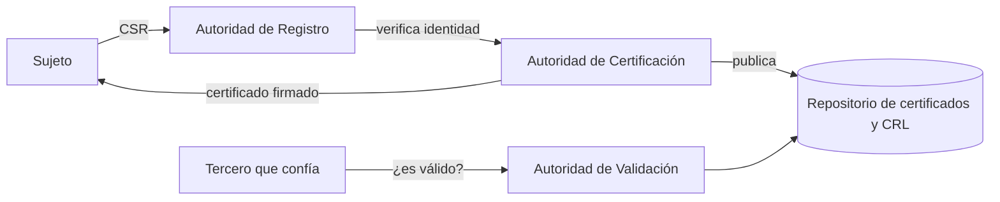

---
{"dg-publish":true,"permalink":"/bastionado-de-redes-y-sistemas/unidad-3-administracion-de-credenciales-de-acceso/apuntes/3-infraestructuras-de-clave-publica-pki/","tags":["asignatura/bastionado-de-redes-y-sistemas","pki"],"dgShowToc":true,"noteIcon":"","dg-note-properties":{"tipo":"apunte","asignatura":"Bastionado de redes y sistemas","tema":3,"apartado":"3","tags":["asignatura/bastionado-de-redes-y-sistemas","pki"]}}
---


# 3. Infraestructuras de clave pública (PKI)

## 3.1 Concepto de PKI

El modelo de confianza basado en **Terceras Partes Confiables** es la base de las **Infraestructuras de Clave Pública** (ICP o PKI, *Public Key Infrastructure*).

Una **PKI** es un conjunto de roles, políticas, *hardware*, *software* y procedimientos necesarios para **crear, manejar, distribuir, almacenar y revocar** certificados digitales y gestionar el cifrado de clave pública. Permite ejecutar con garantías operaciones criptográficas como el **cifrado**, la **firma digital** y el **no repudio** de transacciones electrónicas.

Una PKI debe proporcionar:

- **Confidencialidad** (el mecanismo más usado es TLS).
- **Integridad.**
- **Autenticidad.**

> [!warning] Uso incorrecto del término
> A veces se llama "PKI" a cualquier uso de algoritmos de clave pública. Es incorrecto: no hacen falta métodos específicos de PKI para usar criptografía asimétrica (p. ej., las claves SSH no requieren una CA).

### 3.1.1 Recordatorio: criptografía asimétrica

La criptografía simétrica, la asimétrica, el *hash* y la firma digital se explican en la UD2: [[Bastionado de redes y sistemas/Unidad 2 Control de acceso y autenticación/Apuntes/3. Mecanismos y factores de autenticación#3.5 Certificados electrónicos, criptografía y dispositivos de usuario\|Certificados electrónicos y criptografía]]. Aquí se recuerda solo lo necesario para la PKI.


- Cada entidad tiene un **par de claves**: una **pública** (se puede entregar a cualquiera) y una **privada** (solo la conoce su propietario).
- Lo que cifra la clave pública solo lo descifra la privada, y viceversa.
- **Cifrar con la pública del destinatario** → **confidencialidad**.
- **Cifrar con la privada del emisor** → **autenticación** del remitente: es el fundamento de la **firma digital**.
- Algoritmos: **RSA** (basado en la dificultad de factorizar números grandes; más lento que los simétricos), **DSA** (firma digital, NIST), **ElGamal** (usado en GnuPG).

**Firma digital:** se aplica una **función *hash*** al documento (SHA-2; MD5 y SHA-1 están desaconsejados por colisiones) y se cifra el resumen con la **clave privada** del emisor. Garantiza **autenticidad, integridad y no repudio**. Si además se quiere confidencialidad, se cifra el resultado con la clave pública del receptor.

El problema es la **distribución de las claves públicas** y asegurar su **autenticidad**: garantizar que una clave pública pertenece a quien dice ser. Para eso existen los **certificados digitales** y la PKI.

## 3.2 Servicios, propósito y funcionalidad

Servicios que ofrece una PKI:

- **Registro de claves:** emisión de un nuevo certificado para una clave pública.
- **Revocación de certificados:** cancelación de un certificado previamente emitido.
- **Selección de claves:** publicación de la clave pública de los usuarios.
- **Evaluación de la confianza:** determinar si un certificado es válido y qué operaciones permite.
- **Recuperación de claves:** posibilidad de recuperar las claves de un usuario.

La PKI permite a los usuarios autenticarse frente a otros y usar la información de los certificados (claves públicas ajenas) para cifrar y descifrar, firmar, garantizar el no repudio, etc. En una operación con PKI intervienen como mínimo:

- Un **usuario iniciador** de la operación.
- Unos **sistemas servidores** que dan fe de la operación y garantizan la validez de los certificados (autoridad de certificación, autoridad de registro y sellado de tiempo).
- Un **destinatario** de los datos cifrados/firmados (puede ser el propio iniciador).

> [!important] La seguridad depende de la clave privada y de las políticas
> Los algoritmos son públicos, así que la seguridad de la PKI depende de la **privacidad de la clave privada** y de las **políticas de seguridad** aplicadas. De nada sirve una *smart card* si se guarda una copia de la clave privada en el disco duro de un PC conectado a Internet.

## 3.3 Tipos de certificados digitales

**Según la información que contienen y su titular:**

- **Certificado personal:** acredita la identidad del titular.
- **Certificado de pertenencia a empresa:** además, acredita su vinculación con la entidad para la que trabaja.
- **Certificado de representante:** además, acredita los poderes de representación del titular sobre la empresa.
- **Certificado de persona jurídica:** identifica a una empresa o sociedad en trámites ante administraciones o instituciones.
- **Certificado de atributo:** identifica una cualidad, estado o situación (médico, director, apoderado…). Va asociado al certificado personal.

**Según su finalidad (entornos técnicos):**

- **Certificado de servidor seguro (SSL/TLS de servidor):** identifica a un servidor web ante sus clientes y protege el intercambio de información.
- **Certificado SSL de cliente:** identifica a una persona física ante un servidor.
- **Certificado S/MIME:** correo electrónico firmado y cifrado.
- **Certificado de firma de código:** garantiza la autoría y la no modificación del código de las aplicaciones.
- **Certificado de CA:** permite al *software* cliente comprobar si puede confiar en los certificados emitidos por esa autoridad.

**Según la verificación de datos realizada:**

| Clase | Comprobaciones |
| --- | --- |
| Clase 1 | Solo nombre y correo electrónico del titular. |
| Clase 2 | Además, documento de identidad con fotografía, nº de la Seguridad Social y fecha de nacimiento. |
| Clase 3 | Además, verificación de crédito de la persona o empresa. |
| Clase 4 | Además, verificación del cargo o posición en la organización. |

## 3.4 Componentes de una PKI

- **Autoridad de certificación (CA, *Certificate Authority*):** emite y revoca certificados. Es la entidad de confianza que legitima la relación entre una clave pública y la identidad de un usuario o servicio.
- **Autoridad de registro (RA, *Registration Authority*):** verifica el enlace entre la clave pública del certificado y la identidad de su titular; recibe las solicitudes y comprueba su autenticidad.
- **Repositorios:** almacenan la información de la PKI; los principales son el **repositorio de certificados** y el de **listas de revocación (CRL, *Certificate Revocation List*)**, que incluye los certificados que han dejado de ser válidos antes de su fecha de caducidad.
- **Autoridad de validación (VA, *Validation Authority*):** comprueba la validez de los certificados.
- **Autoridad de sellado de tiempo (TSA, *TimeStamp Authority*):** firma documentos para probar que existían antes de un instante determinado.
- **Usuarios y entidades finales:** poseen un par de claves y un certificado asociado a su clave pública, y usan aplicaciones basadas en PKI.



### 3.4.1 Tipos de PKI

| Tipo | Características |
| --- | --- |
| **Basada en CA** | Sistema **centralizado**. Requiere gestionar los certificados de las CA. Es el modelo ampliamente usado en la web. |
| **Web of Trust** (red de confianza) | Sistema **descentralizado**: los propios usuarios firman las claves de otros. Ejemplo: OpenPGP / GnuPG. |

## 3.5 Consideraciones sobre PKI

- Todo certificado válido debe ser emitido por una **CA reconocida**, que garantiza la asociación entre el poseedor y el certificado.
- El **poseedor** es responsable de la **custodia de su clave privada**.
- Las **entidades de registro** verifican la veracidad de los datos del solicitante y gestionan el ciclo de vida de las peticiones hacia la CA.
- El certificado solo puede usarse para los **usos para los que fue creado** según las políticas.
- Toda operación del poseedor debe hacerse de forma presencial y dentro del *hardware* cliente: tarjeta criptográfica (**PKCS#11**) u otro dispositivo seguro como el fichero seguro (**PKCS#12**).
- Las comunicaciones con PKI **no requieren intercambiar ninguna clave secreta** para establecerse, por lo que se consideran muy seguras si se siguen las políticas.

**Seguridad de los certificados:** depende en parte de cómo se guarden las claves privadas. Existen **tokens de seguridad** que protegen la clave privada e impiden exportarla; pueden incorporar **biometría** (huella dactilar) para asegurar que solo el dueño pueda usar el certificado.

## 3.6 El certificado digital X.509

El **certificado digital** (o certificado de clave pública) es un documento electrónico que prueba la propiedad de una clave pública. Incluye la clave pública, la identidad del propietario (*Subject*), la firma digital de una CA (*Issuer*) y otros datos (fechas de validez…).

**X.509** es el estándar UIT-T de certificado digital, usado en muchos protocolos, en particular **TLS**. Estructura de un certificado **X.509 v3**:

- Versión.
- Número de serie.
- Algoritmo usado por la CA para firmar (típicamente RSA o DSA).
- **Emisor** (CA).
- **Validez:** "no antes de" y "no después de".
- **Sujeto**, en notación DN (*Distinguished Name*): CN (*Common Name*), OU (*Organizational Unit*), O (*Organization*), C (*Country*). Puede ser una persona, un servidor o un servicio.
- Información de la clave pública del sujeto (algoritmo y clave).
- Identificadores únicos de emisor y sujeto (opcionales).
- Extensiones (opcionales).
- Algoritmo de firma y **firma digital de la CA**.

> [!note] ¿Por qué hace falta una CA reconocida?
> Cualquiera puede generar un certificado, pero si el emisor no es reconocido por quienes lo reciben, su valor es prácticamente nulo. Por eso las CA se **acreditan** ante entidades reconocidas, que transmiten esa fiabilidad a los certificados que emiten.

### 3.6.1 Formatos de archivo

| Extensión | Contenido |
| :-: | --- |
| `.CER` | Certificado codificado en CER (*Canonical Encoding Rules*). |
| `.DER` | Certificado codificado en DER (*Distinguished Encoding Rules*), binario. |
| `.PEM` | Certificado en Base64 entre `-----BEGIN CERTIFICATE-----` y `-----END CERTIFICATE-----`. |
| `.P7B` / `.P7C` | Estructura PKCS#7. |
| `.PFX` / `.P12` | Estructura PKCS#12: puede contener certificados **y claves privadas** (protegido con contraseña). |

## 3.7 Ciclo de vida de un certificado. CSR

Procedimiento para obtener un certificado X.509:

1. Se genera una **clave privada**.
2. Con ella se genera un **CSR** (*Certificate Signing Request*) con los datos de identificación.
3. Se envía el CSR a la **RA**.
4. La RA comprueba su autenticidad y lo transfiere a la **CA**.
5. La CA **firma** el certificado por un periodo de validez y lo devuelve.
6. Si fuese necesario, el sujeto envía un **CRR** (*Certificate Revoke Request*) a la RA para revocarlo.

El **CSR** es un bloque de texto codificado, normalmente generado en el servidor donde se usará el certificado (con herramientas como OpenSSL). Contiene los datos que figurarán en el certificado (nombre u organización, dirección, país, *common name* o dominio) y la **clave pública**. Suele ir en PEM/Base64 entre `-----BEGIN CERTIFICATE REQUEST-----` y `-----END CERTIFICATE REQUEST-----`.

**Software X.509:** OpenSSL, LibreSSL, GnuTLS, CFSSL…

> [!example] Ejemplo: generar un CSR y un certificado autofirmado con OpenSSL (conocimiento general, verificar)
> ```bash
> # Clave privada RSA de 2048 bits y CSR
> openssl req -new -newkey rsa:2048 -nodes -keyout servidor.key -out servidor.csr
> # Certificado autofirmado válido 365 días (sin CA externa)
> openssl x509 -req -days 365 -in servidor.csr -signkey servidor.key -out servidor.crt
> # Ver el contenido del certificado
> openssl x509 -in servidor.crt -text -noout
> ```

### 3.7.1 PKI propia en Windows: AD CS

**AD CS** (*Active Directory Certificate Services*) es el rol de Windows Server que permite crear una PKI interna en lugar de recurrir a una CA de terceros. Implementa una jerarquía de claves públicas. Dos esquemas:

- **CA independiente:** puede instalarse en un servidor miembro de dominio o de grupo de trabajo (no necesita AD). Se usa en PKI de varias capas: una **CA raíz independiente** en lo alto genera certificados para las **CA intermedias**. Requiere configurar:
  - **CDP** (*CRL Distribution Points*): ubicación de la CRL para validar certificados.
  - **AIA** (*Authority Information Access*): ubicación del certificado de la CA raíz.
- **CA empresarial:** integrada en Active Directory; suele actuar como CA **emisora**. Se instala en un servidor miembro del dominio y los usuarios pueden solicitar certificados que se aprueban directamente.

## 3.8 Validación de certificados. TLS y HTTPS

**TLS** (*Transport Layer Security*, sucesor de SSL) añade cifrado a otros protocolos: **HTTPS** (HTTP+TLS), **SMTPS**, **LDAPS**, **FTPS**… Puede usar un puerto propio o **STARTTLS** en el puerto habitual.

| Versión | Estado |
| :-: | :-: |
| TLS 1.0 (≈ SSL 3.0) | Obsoleta desde 2020 |
| TLS 1.1 | Obsoleta desde 2020 |
| TLS 1.2 | En uso |
| TLS 1.3 | En uso |

Procedimiento simplificado (HTTPS):

1. El cliente presenta la lista de funciones de cifrado y *hash* que puede usar.
2. El servidor elige y se lo comunica, y envía su **certificado X.509**.
3. El cliente **comprueba la validez** del certificado verificando la **firma de la CA** con la clave pública de la CA, que tiene en su lista de CA de confianza. Si la CA es desconocida, el navegador puede ofrecer aceptarlo **bajo responsabilidad del usuario**.
4. Se genera una **clave de sesión** simétrica que se comparte cifrándola con la clave pública del servidor, y se usa en el resto de la comunicación.

Habitualmente solo se autentica el servidor; la autenticación mutua requiere desplegar PKI también para los clientes.

### 3.8.1 Cómo se verifica la firma de un certificado

La CA calcula un *hash* de la parte de datos del certificado (datos + clave pública) y lo cifra con su clave privada. Para validar, el cliente:

1. Toma la **clave pública de la CA** emisora (de su almacén de certificados raíz).
2. Descifra la firma del certificado y obtiene el *hash*.
3. Calcula él mismo el *hash* de la parte de datos.
4. Si ambos coinciden, el certificado es auténtico y está vinculado a esa clave pública; si no, el sitio podría no ser quien dice ser.

> [!example] Ejemplo: certificado antiguo de www.freesoft.org
> Emitido por *Thawte Server CA*, firmado con `md5WithRSAEncryption`, clave RSA de 1024 bits y validez de un año (1998-1999). El **CN** `www.freesoft.org` es la parte que debe coincidir con el servidor al que nos conectamos. Hoy se consideraría inválido por varios motivos: caducado, MD5 inseguro y clave corta.

### 3.8.2 Certificados válidos e inválidos

Comprobaciones básicas (recomendaciones de seguridad del bloque 1):

- La URL empieza por **https**.
- Existe un certificado, visible al pulsar el **candado** del navegador.
- El certificado **no ha caducado**.
- Herramienta en línea para analizar un sitio: <https://www.ssllabs.com/ssltest/index.html>.

Motivos por los que un certificado puede ser **inválido**, deducidos de los campos y componentes vistos:

| Motivo | Campo o mecanismo implicado |
| --- | --- |
| Caducado o aún no válido | Validez ("no antes de" / "no después de") |
| El nombre no coincide con el sitio | *Subject* CN (y nombres alternativos) |
| Emisor no reconocido / autofirmado | Firma de la CA; almacén de CA de confianza |
| Revocado antes de su caducidad | CRL / Autoridad de validación |
| Algoritmos débiles (MD5, SHA-1, claves cortas) | Algoritmo de firma y clave pública |

> [!tip]
> Para practicar con certificados inválidos por distintos motivos puede usarse el sitio <https://badssl.com> (actualizado, fuente: [badssl.com](https://badssl.com)). Ver [[Bastionado de redes y sistemas/Unidad 3 Administración de credenciales de acceso/Prácticas/P2 - UD3 Validez y autenticidad de certificados web\|P2 - UD3 Validez y autenticidad de certificados web]].

## 3.9 Certificados y claves para el acceso a un servidor remoto (SSH)

SSH (puerto 22, sustituto de telnet, rlogin, rsh, rcp o ftp) usa criptografía asimétrica tanto para autenticar al **servidor** como, opcionalmente, al **usuario**:

1. El servidor envía su clave pública al cliente.
2. El cliente la compara con la que tiene almacenada; la primera vez pide confirmación (riesgo de ***man in the middle***).
3. El cliente genera una clave de sesión aleatoria, la cifra con la clave pública del servidor y se la envía; el resto de la comunicación usa cifrado simétrico.

**Ficheros de claves privadas** (las públicas son iguales acabadas en `.pub`):

| Cliente | Servidor |
| --- | --- |
| `~/.ssh/id_rsa` | `/etc/ssh/ssh_host_rsa_key` |
| `~/.ssh/id_dsa` | `/etc/ssh/ssh_host_dsa_key` |
| `~/.ssh/id_ecdsa` | `/etc/ssh/ssh_host_ecdsa_key` |
| `~/.ssh/id_ed25519` | `/etc/ssh/ssh_host_ed25519_key` |

**Acceso por clave pública:**

```bash
# 1. Generar el par de claves en el cliente (-t tipo, -b bits, -f fichero)
ssh-keygen -t rsa -b 4096
# 2. Copiar la clave pública al servidor (se añade a ~/.ssh/authorized_keys)
ssh-copy-id -i ~/.ssh/id_rsa.pub usuario@servidor
# 3. Conectar usando la clave privada (pide la passphrase, no la contraseña)
ssh -i ~/.ssh/id_rsa usuario@servidor
```

- **ssh-agent** gestiona las claves privadas durante la sesión; con **ssh-add** se añaden las claves a gestionar. Útil al trabajar con varios servidores.
- Para exigir siempre clave, en `/etc/ssh/sshd_config`: `PasswordAuthentication no` (y comprobar `AuthorizedKeysFile .ssh/authorized_keys`). El resto de directivas de `sshd_config` están en [[Bastionado de redes y sistemas/Unidad 2 Control de acceso y autenticación/Apuntes/5. Control de acceso#5.7.2 Configuración del acceso SSH\|Configuración del acceso SSH]] (UD2).

> [!info] Actualización 2026
> Las claves **DSA** (`id_dsa`, `ssh_host_dsa_key`) están desactivadas por defecto desde OpenSSH 7.0 y se eliminaron del todo en **OpenSSH 10.0** (2025). Usa **Ed25519** o ECDSA/RSA ≥ 3072 bits (actualizado, fuente: [OpenSSH Release Notes](https://www.openssh.org/releasenotes.html)).

> [!note] GPG
> **GPG** cifra ficheros con claves asimétricas y firma textos (modelo *Web of Trust*): `gpg --gen-key`, `gpg --export`, `gpg --import`, `gpg --encrypt --recipient <id> fichero`, `gpg -d fichero.gpg`.

El bastionado completo de SSH se trata en [[Bastionado de redes y sistemas/Unidad 7 Configuración de sistemas informáticos/Apuntes/5. Securización de la administración remota\|5. Securización de la administración remota]].

> [!example] Actividad 2
> Un usuario accede a `https://intranet.empresa.local` y el navegador muestra un aviso. Al ver el certificado observa que el emisor es `intranet.empresa.local` y coincide con el sujeto. ¿Qué tipo de certificado es y por qué el navegador desconfía?

> [!success]- Solución
> Es un **certificado autofirmado**: emisor y sujeto coinciden. El navegador no puede verificar la firma con ninguna CA de su almacén de confianza, así que no puede garantizar la autenticidad. Solución: emitirlo desde una CA reconocida o desde una CA interna (p. ej. AD CS) cuyo certificado raíz esté instalado en los equipos.

> [!quote]- Fuentes
> - `Bloque 3- Admon Credenciales Acceso S.Infomáticos.pdf` (apdo. 2, págs. 6-10)
> - `1-PKI.pdf` (A. Molina: PKI, tipos, X.509, TLS)
> - `00-Unidad 1 - Mecanismos de autenticación y gestión de credenciales.odt` (criptografía, firma digital, certificados, X.509, formatos, CSR, SSL, SSH, AD CS)
> - `C11+-+S5_03+-+SSH+y+GPG.pdf`; `Bloque 2- Sistemas Control de Acceso.pdf` (acceso por certificado SSH); `UT 7- Confiiguración de SI.pdf` (clave pública SSH)
> - `Bloque 1-Diseño de Planes de Securización.pdf` (comprobación de certificados web)

🡠 [[Bastionado de redes y sistemas/Unidad 3 Administración de credenciales de acceso/Apuntes/2. Gestión de credenciales\|2. Gestión de credenciales]] ⮅ [[Bastionado de redes y sistemas/Unidad 3 Administración de credenciales de acceso/Apuntes/3. Infraestructuras de clave pública (PKI)#3. Infraestructuras de clave pública (PKI)\|#3. Infraestructuras de clave pública (PKI)]] 🡢 [[Bastionado de redes y sistemas/Unidad 3 Administración de credenciales de acceso/Apuntes/4. Acceso mediante firma electrónica\|4. Acceso mediante firma electrónica]]
