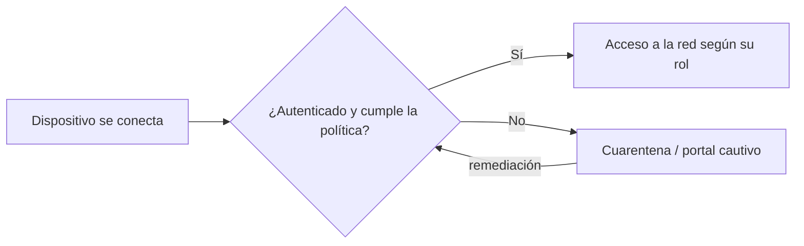

---
{"dg-publish":true,"permalink":"/bastionado-de-redes-y-sistemas/unidad-3-administracion-de-credenciales-de-acceso/apuntes/5-gestion-de-accesos-sistemas-nac/","tags":["asignatura/bastionado-de-redes-y-sistemas","nac"],"dgShowToc":true,"noteIcon":"","dg-note-properties":{"tipo":"apunte","asignatura":"Bastionado de redes y sistemas","tema":3,"apartado":"5","tags":["asignatura/bastionado-de-redes-y-sistemas","nac"]}}
---

# 5. Gestión de accesos. Sistemas NAC

El **control de acceso a red** (*Network Access Control*, **NAC**) es un enfoque de seguridad que intenta **unificar** la seguridad de los equipos finales (antivirus, prevención de intrusión en *hosts*, informes de vulnerabilidades), la **autenticación** de usuarios o sistemas y el refuerzo de la seguridad de la **red de acceso**.

El término no es nuevo, pero ofrecer una solución completa para todo tipo de dispositivos y usuarios solía estar limitado por restricciones de *hardware* o *software*.

- Las primeras soluciones NAC ofrecían un **servidor de administración de políticas** que dictaba qué podían hacer los usuarios y dispositivos identificados en una red, haciendo cumplir las políticas de la organización y ciertas regulaciones.
- También restringían los dispositivos según su **estado operativo**: ¿tiene los parches del sistema operativo?, ¿*firewall*, antivirus o antimalware activos?, ¿aplicaciones restringidas instaladas?
- **Limitación:** solían estar restringidas a sistemas operativos concretos o que admitieran un **agente NAC**, y necesitaban un mecanismo de derivación para impresoras y otros periféricos.

## 5.1 Escenario

NAC es un conjunto de protocolos que define cómo asegurar los nodos **antes** de que accedan a la red. Puede integrar la **remediación automática** (corregir los nodos que no cumplen antes de darles acceso), haciendo que *routers*, *switches* y *firewalls* trabajen junto con el *back office* y los equipos de usuario.

Su objetivo es exactamente lo que indica su nombre: controlar el acceso a la red con políticas, incluyendo **pre-admisión**, chequeo de políticas en el equipo final y **controles post-admisión** sobre a qué recursos se accede y qué se hace en ellos.

## 5.2 Objetivos del control de acceso a red

- **Mitigar ataques de día cero:** impedir que equipos sin antivirus, parches o prevención de intrusiones accedan a la red y contaminen a otros (expansión de gusanos).
- **Refuerzo de políticas:** definir políticas (tipos de equipo o roles de usuario con acceso a ciertas áreas) y aplicarlas en *switches* y *routers*.
- **Administración de acceso e identidad:** en lugar de basar el acceso en direcciones IP, NAC lo basa en la **identidad de usuarios autenticados**.

## 5.3 Conceptos

### 5.3.1 Pre-admisión y post-admisión

| NAC de pre-admisión | NAC de post-admisión |
| --- | --- |
| Inspecciona las estaciones **antes** de permitirles el acceso. Ej.: impedir que equipos con antivirus desactualizado se conecten a servidores sensibles. | Toma decisiones basándose en las **acciones del usuario** una vez que ya tiene acceso. |

### 5.3.2 Con agente vs. sin agente

La red decide en función de información sobre los sistemas finales. La diferencia clave es si esa información la proporciona un **agente software** instalado en el equipo o si se obtiene **remotamente** mediante técnicas de escaneo e inventariado.

### 5.3.3 Remediación: cuarentena y portal cautivo

Algunos clientes legítimos serán rechazados (si todos los equipos estuvieran siempre actualizados, NAC no sería necesario), así que hace falta un mecanismo para que el usuario **remedie** su problema. Las dos estrategias comunes son:

- **Redes de cuarentena:** el equipo se ubica en una red restringida donde solo puede actualizarse.
- **Portales cautivos:** se intercepta la navegación del usuario y se le redirige a una página donde debe autenticarse o corregir su situación.

> [!note]
> En la práctica, NAC suele apoyarse en la autenticación **IEEE 802.1X** contra un servidor [[Bastionado de redes y sistemas/Unidad 3 Administración de credenciales de acceso/Apuntes/7. RADIUS, TACACS y Kerberos#7.2 RADIUS\|RADIUS]] y en la asignación dinámica de [[Bastionado de redes y sistemas/Unidad 4 Diseño de redes seguras/Apuntes/6. Redes virtuales (VLAN)\|UD4-6. Redes virtuales (VLAN)]] (conocimiento general, verificar).

## 5.4 Cómo trabajan las soluciones NAC actuales

- Las soluciones *endpoint* (p. ej., Adaptive Defense de Panda o Intercept X de Sophos) se centran en el **comportamiento del usuario**; las soluciones NAC se centran en el **uso de la propia red**, dando visibilidad, facilitando la gestión, reduciendo el impacto de intrusiones y mejorando la productividad.
- NAC establece **a qué entornos de red puede acceder cada usuario**. Ejemplo: consultores externos que deben conectarse a ciertos servidores, pero a ninguna otra parte de la red.
- Permiten definir **perfiles**, **requisitos de conexión** (antivirus instalado, reconocimientos personales…) e incluso virtualizar los entornos de red, con ahorros en servicios de infraestructura (costosos de adquirir, mantener y administrar).

## 5.5 Funcionalidades de las soluciones NAC

- Descubren cada dispositivo conectado a la red y controlan su comportamiento.
- Adaptan y configuran la red dinámicamente, sin intervención humana.
- Detectan dispositivos infectados.
- Establecen un entorno seguro para los **dispositivos móviles privados** de los empleados.
- Establecen **políticas de acceso homogéneas** para toda la red.
- Optimizan el consumo energético de los dispositivos.

## 5.6 Dónde se utilizan las soluciones NAC

- Control de **proveedores** que trabajan en la red corporativa.
- Control de **oficinas remotas**.
- Redes de **infraestructuras críticas**: redes industriales, plantas nucleares…
- **Redes corporativas.**
- Gestión de **BYOD** (*Bring Your Own Device*): p. ej., campus universitarios con miles de alumnos, donde NAC detecta equipos infectados, marca los que no se comportan correctamente, exige mínimos de *software* de seguridad y automatiza instrucciones.

Enlaces de ampliación:

- <https://www.cisco.com/c/es_mx/products/security/what-is-network-access-control-nac.html>
- <https://normaiso27001.es/a9-control-de-acceso/>

> [!example] Actividad 4
> Un portátil de un visitante se conecta a la red cableada de la empresa sin antivirus actualizado. Describe qué haría un NAC de pre-admisión y qué mecanismo de remediación podría usarse.

> [!success]- Solución
> El NAC inspeccionaría el equipo antes de darle acceso, detectaría que no cumple la política (antivirus desactualizado) y le denegaría el acceso normal. Lo enviaría a una **red de cuarentena** o a un **portal cautivo** donde pueda actualizar el antivirus; tras la remediación, se volvería a evaluar y se le daría acceso limitado a los recursos permitidos para visitantes.

> [!quote]- Fuentes
> - `Bloque 3- Admon Credenciales Acceso S.Infomáticos.pdf` (apdo. 4, págs. 13-16)
> - `00-Unidad 1 - Mecanismos de autenticación y gestión de credenciales.odt` (NAC en la capa de red LAN de la defensa en profundidad)

🡠 [[Bastionado de redes y sistemas/Unidad 3 Administración de credenciales de acceso/Apuntes/4. Acceso mediante firma electrónica\|4. Acceso mediante firma electrónica]] ⮅ [[Bastionado de redes y sistemas/Unidad 3 Administración de credenciales de acceso/Apuntes/5. Gestión de accesos. Sistemas NAC#5. Gestión de accesos. Sistemas NAC\|#5. Gestión de accesos. Sistemas NAC]] 🡢 [[Bastionado de redes y sistemas/Unidad 3 Administración de credenciales de acceso/Apuntes/6. Gestión de cuentas privilegiadas\|6. Gestión de cuentas privilegiadas]]
