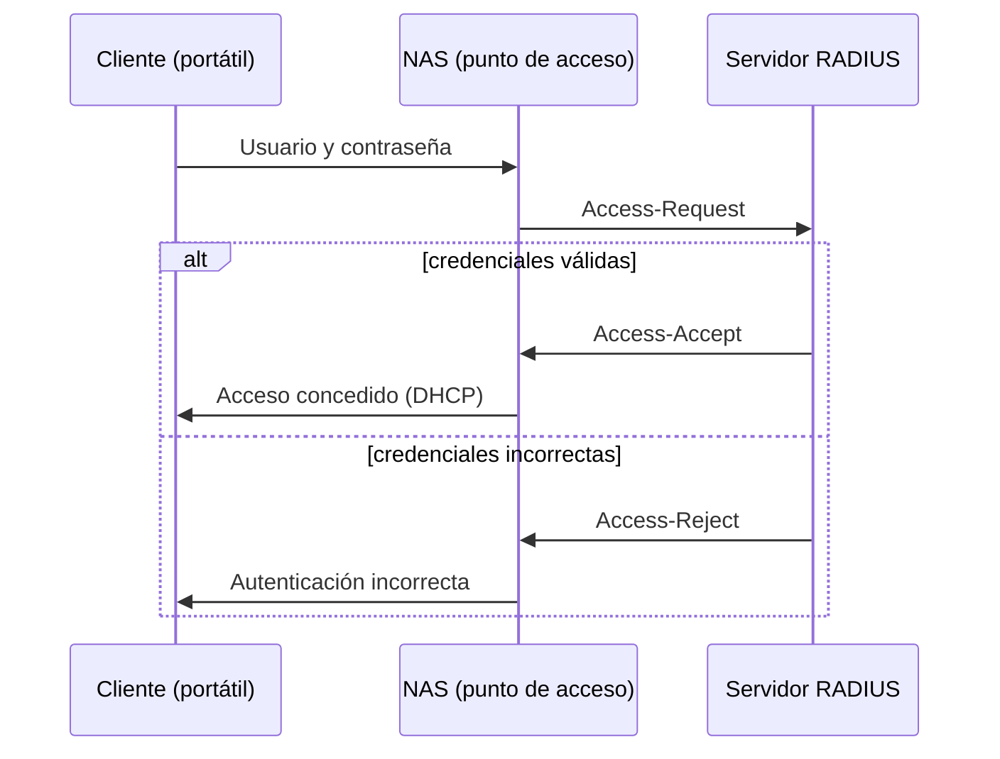
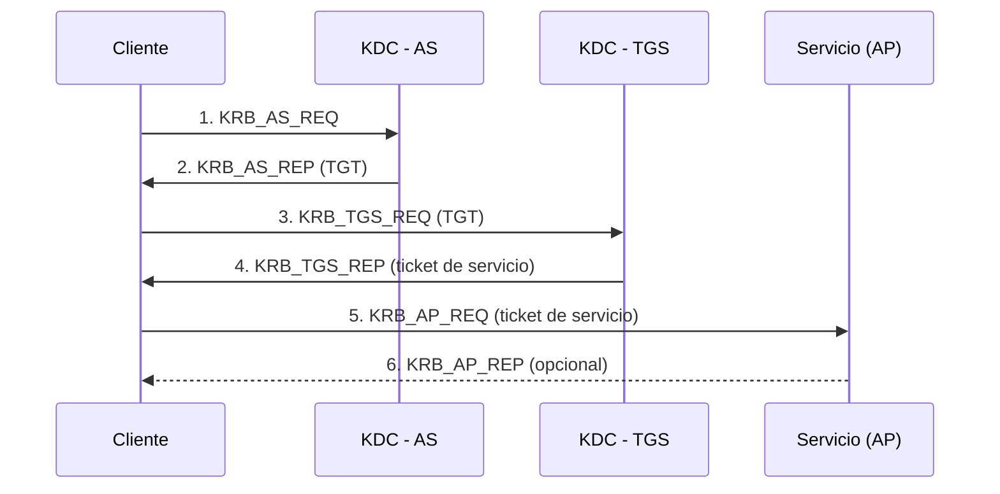

---
{"dg-publish":true,"permalink":"/bastionado-de-redes-y-sistemas/unidad-3-administracion-de-credenciales-de-acceso/apuntes/7-radius-tacacs-y-kerberos/","tags":["asignatura/bastionado-de-redes-y-sistemas","radius-kerberos"],"dgShowToc":true,"noteIcon":"","dg-note-properties":{"tipo":"apunte","asignatura":"Bastionado de redes y sistemas","tema":3,"apartado":"7","tags":["asignatura/bastionado-de-redes-y-sistemas","radius-kerberos"]}}
---

# 7. RADIUS, TACACS y Kerberos

Estos protocolos permiten **centralizar** la autenticación: en lugar de que cada servicio o dispositivo de red tenga su propio mecanismo, se **delega** en un servidor especializado.

> [!note] AAA
> Los protocolos **AAA** proporcionan:
> - **Autenticación** (*Authentication*): quién es el usuario.
> - **Autorización** (*Authorization*): qué puede hacer.
> - **Contabilidad de uso** (*Accounting*): qué ha hecho (registro de actividad).

## 7.1 TACACS

**TACACS** (*Terminal Access Controller Access Control System*) es un protocolo de autenticación remota, comúnmente usado en redes Unix, que permite a un **servidor de acceso remoto** comunicarse con un **servidor de autenticación** para determinar si el usuario tiene acceso a la red. Está documentado en el **RFC 1492**.

Su evolución, **TACACS+**, es un protocolo **propietario de Cisco** usado también para proporcionar AAA, alternativo a RADIUS.

> [!warning] Falta fuente: detalle técnico de TACACS+
> Las fuentes solo remiten a un enlace de configuración en Cisco. No detallan puertos, cifrado ni diferencias con RADIUS.

## 7.2 RADIUS

**RADIUS** (*Remote Authentication Dial-In User Service*) es un protocolo estándar de tipo **AAA** muy utilizado para el acceso a redes y la movilidad IP. Usa el puerto **1812/UDP**. Permite la **autenticación centralizada** y una de sus características más importantes es que **maneja sesiones**, notificando cuándo empieza y termina una conexión.

Durante años se usó sobre todo en las conexiones a **ISP**, y luego se extendió a múltiples protocolos de red.

### 7.2.1 Arquitectura y funcionamiento

- **Servidor RADIUS:** autentica, aplica las políticas de acceso a la red y registra la actividad.
- **Cliente RADIUS o NAS** (*Network Access Server*): el dispositivo de acceso (punto de acceso wifi, *switch*, servidor VPN…) que redirige las peticiones al servidor RADIUS.

En una conexión a un ISP (módem, DSL, cable, Ethernet o wifi), el usuario envía usuario y contraseña al **NAS** mediante **PPP**; el NAS reenvía la petición al servidor RADIUS mediante el **protocolo RADIUS**; el servidor comprueba las credenciales (PAP, CHAP o EAP) y, si son correctas, autoriza el acceso y asigna recursos (dirección IP, L2TP…).

Ejemplo en una red wifi:

1. Un portátil solicita acceso a la red wifi (punto de acceso) con el usuario y la contraseña facilitados por el departamento de informática.
2. El punto de acceso envía las credenciales al **servidor RADIUS**. Si no son válidas, se deniega el acceso y se informa al cliente.
3. Si son correctas, el servidor RADIUS **autoriza** al cliente y se lo comunica al punto de acceso.
4. El punto de acceso, mediante **DHCP**, entrega al cliente IP, máscara, puerta de enlace y DNS.

> [!note]
> Los nombres de mensaje *Access-Accept* y *Access-Reject* son conocimiento general (verificar); la fuente solo menciona *Access-Request*.

### 7.2.2 Autenticación

RADIUS puede autenticar **directamente** mediante:

- **PAP** (*Password Authentication Protocol*): muy simple, envía usuario y contraseña **en claro**; puede protegerse con un mecanismo adicional (p. ej., TTLS).
- **CHAP** (*Challenge-Handshake Authentication Protocol*): el servidor envía una cadena aleatoria (desafío), el cliente la cifra con la contraseña y devuelve el resultado; el servidor lo comprueba con la contraseña que posee.
- **EAP** (*Extensible Authentication Protocol*): extensible, con múltiples métodos: EAP-MD5, EAP-TLS, EAP-TTLS…

O actuar como **pasarela** hacia métodos externos: **LDAP**, **Kerberos**, **SQL**, **redis**… También admite Login Unix.

### 7.2.3 Autorización y contabilidad

**Autorización:** garantiza o restringe servicios según quién es el usuario, qué solicita y el estado del sistema:

- Filtrado IP.
- Asignación de IP, rutas, QoS.
- Control del ancho de banda.
- Restricción de servicios.
- Cifrado (L2TP, SSTP, IPSec, IKEv2).
- Condiciones: grupos de Windows, usuarios, restricciones horarias, IP, tipo de equipo, inactividad, tiempo de sesión…

**Contabilidad (*accounting*):** registra la actividad del usuario: hora de conexión y desconexión, duración, cantidad de tráfico y servicios utilizados. El *logging* y el *accounting* pueden almacenarse en una base de datos **SQL**, un **fichero de texto** local o un **directorio LDAP**.

### 7.2.4 Casos de uso e implementaciones

- **Ámbitos:** ISP, **wifi** (WPA-Enterprise), **redes cableadas (IEEE 802.1X)**, redes locales complejas, **VPN**, conexión a dominios Windows. Es también la base habitual de los [[Bastionado de redes y sistemas/Unidad 3 Administración de credenciales de acceso/Apuntes/5. Gestión de accesos. Sistemas NAC\|sistemas NAC]].
- **Implementaciones:** **FreeRADIUS** (Linux), OpenRADIUS, Radiator, Microsoft RADIUS (NPS), Cisco RADIUS.

### 7.2.5 Seguridad en RADIUS

Debilidades:

- Los mensajes **no viajan cifrados**, salvo los datos especialmente sensibles como las contraseñas.
- Usa **MD5** como *hash*, vulnerable a ataques de colisión.
- Funciona sobre **UDP**, por lo que las IP pueden falsearse fácilmente (suplantación).
- La especificación de la **clave compartida** (*shared secret*) no es suficientemente robusta y el servidor la reutiliza con los clientes: es vulnerable a **fuerza bruta**; obtenida la clave, el campo *Authenticator* de los mensajes *Access-Request* se genera fácilmente.

Contramedidas:

- Implementar **IPSec** para cifrar las comunicaciones entre cliente y servidor.
- Reforzar la autenticación con protocolos **desafío-respuesta** robustos, como CHAP.
- Usar **DIAMETER**, evolución de RADIUS:
  - Transporte fiable (**TCP** o **SCTP**).
  - Seguridad a nivel de transporte (**IPSec** o **TLS**).
  - Protocolo **punto a punto** en lugar de cliente-servidor: cualquier nodo puede iniciar el intercambio.

## 7.3 Kerberos

**Kerberos** es un protocolo de autenticación de red diseñado por el **MIT**, pensado para aplicaciones cliente-servidor, que permite autenticar **usuarios, equipos y servicios**. Características:

- **Autenticación recíproca (mutua):** cliente y servidor garantizan la autenticidad del otro.
- **La contraseña nunca viaja por la red.**
- Sistema **SSO** (*Single Sign On*).
- Gestión de sesión mediante ***tickets***.
- Basado en **criptografía simétrica**: cada entidad tiene una clave secreta que solo conocen ella y el KDC.
- Usa los puertos **88/UDP y 88/TCP**.

> [!important] Kerberos no autoriza
> Kerberos solo **autentica**; la autorización se combina con otros mecanismos: LDAP, SQL, directivas del sistema, etc.

La implementación más extendida es la integrada en el **Directorio Activo de Windows** (protocolo por defecto); la original es **MIT Kerberos** (*software* libre).

### 7.3.1 Definiciones previas

- **Reino (*realm*):** dominio de autenticación. Suele usarse el dominio DNS en mayúsculas (p. ej. `EMPRESA.LOCAL`).
- **Principal:** registro en la base de datos de Kerberos (usuario, equipo o servicio): `usuario@REINO`, `imap/equipo@REINO`.
- **Ticket:** identificador de sesión para no tener que volver a autenticarse: **TGT** (*Ticket Granting Ticket*) y **TGS** (*ticket* de servicio).
- **KDC** (*Key Distribution Center*): tercero de confianza encargado de la autenticación y de los *tickets*. Consta de:
  - **AS** (*Authentication Service*): comprueba la identidad del usuario.
  - **TGS** (*Ticket Granting Service*): emite los *tickets* de acceso a los servicios.
- **AP** (*Application Server*): servicio al que el usuario quiere acceder.
- **kadmin-server:** servidor donde se definen o modifican los principales.

### 7.3.2 Funcionamiento

1. **KRB_AS_REQ:** el cliente pide autenticarse al AS. Parte del mensaje va cifrada con una clave derivada de su contraseña (en AD, su *hash* NTLM): usa la contraseña, pero esta nunca viaja.
2. **KRB_AS_REP (TGT):** el AS descifra con la clave del usuario almacenada; si es correcto, devuelve el **TGT**, cifrado con una clave compartida con el TGS.
3. **KRB_TGS_REQ:** el cliente presenta el TGT al TGS y solicita acceso a un servicio.
4. **KRB_TGS_REP (TGS):** el TGS emite el ***ticket* de servicio**, cifrado con una clave compartida entre el TGS y el servicio.
5. **KRB_AP_REQ:** el cliente presenta el *ticket* de servicio al servidor, que comprueba su cifrado.
6. **KRB_AP_REP (opcional):** el servicio se autentica ante el usuario (autenticación mutua).

El usuario se autentica ante el AS **una sola vez** y reutiliza el TGT mientras sea válido; los *tickets* tienen una **vida útil configurable**.

### 7.3.3 Ventajas e inconvenientes

| Ventajas | Inconvenientes (y mitigación) |
| --- | --- |
| **Autenticación más rápida:** el servidor autentica al cliente con el *ticket*, sin consultar al controlador de dominio. | **Requisitos de tiempo estrictos:** los relojes deben estar sincronizados con el servidor Kerberos → usar **NTP**. |
| **Autenticación mutua:** solo los servidores legítimos pueden descifrar el *ticket*. | **Dependencia del servidor central:** si cae, nadie inicia sesión → varios servidores Kerberos y mecanismos de reserva. |
| **SSO** entre Windows y otros sistemas compatibles. | **Punto único de compromiso:** si se compromete el KDC o una contraseña, el atacante puede suplantar usuarios → equipos de confianza y preautenticación con *token hardware*. |

### 7.3.4 Uso de Kerberos

- No se usa de forma independiente: se **integra** con los sistemas operativos y servicios de la organización (p. ej., NFSv4 con seguridad Kerberos).
- Se usa principalmente en **redes locales**.
- Es menos habitual integrarlo en aplicaciones, y apenas se ha extendido a la **autenticación web**.

> [!warning] Ataques
> Kerberos no está libre de vulnerabilidades: ***Pass-the-Ticket*** (reutilizar un TGT robado). En AD se mitiga con **Usuarios protegidos**, **Silos de autenticación** y **Credential Guard** (ver [[Bastionado de redes y sistemas/Unidad 3 Administración de credenciales de acceso/Apuntes/6. Gestión de cuentas privilegiadas#6.4.1 PAM en entornos Microsoft Active Directory\|PAM en AD]]).

## 7.4 Comparativa

| | RADIUS | TACACS/TACACS+ | Kerberos |
| :-: | :-: | :-: | :-: |
| Tipo | AAA estándar | AAA (TACACS+ de Cisco) | Autenticación (SSO) |
| Transporte | UDP 1812 | (Falta fuente) | UDP/TCP 88 |
| Uso típico | Wifi, 802.1X, VPN, ISP | Dispositivos de red | Redes locales, Active Directory |
| Criptografía | MD5, secreto compartido | (Falta fuente) | Simétrica, *tickets* |

> [!example] Actividad 6
> Explica por qué se recomienda combinar RADIUS con EAP-TLS/TTLS o IPSec en lugar de usar PAP directamente.

> [!success]- Solución
> PAP envía la contraseña en claro, y RADIUS solo protege los atributos sensibles con MD5 y un secreto compartido débil, sobre UDP. Tunelizar la autenticación (TTLS/TLS) o cifrar el canal con IPSec evita que las credenciales y los mensajes puedan capturarse, falsificarse o atacarse por fuerza bruta.

> [!quote]- Fuentes
> - `Bloque 3- Admon Credenciales Acceso S.Infomáticos.pdf` (apdo. 6, págs. 20-24)
> - `2-RADIUS.pdf` y `3-KERBEROS.pdf` (A. Molina)
> - `00-Unidad 1 - Mecanismos de autenticación y gestión de credenciales.odt` (Kerberos en AD, servidor RADIUS, seguridad en RADIUS, DIAMETER)
> - `UT 7- Confiiguración de SI.pdf` (NFSv4 y Kerberos)

🡠 [[Bastionado de redes y sistemas/Unidad 3 Administración de credenciales de acceso/Apuntes/6. Gestión de cuentas privilegiadas\|6. Gestión de cuentas privilegiadas]] ⮅ [[Bastionado de redes y sistemas/Unidad 3 Administración de credenciales de acceso/Apuntes/7. RADIUS, TACACS y Kerberos#7. RADIUS, TACACS y Kerberos\|#7. RADIUS, TACACS y Kerberos]]
