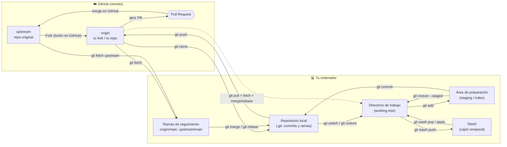
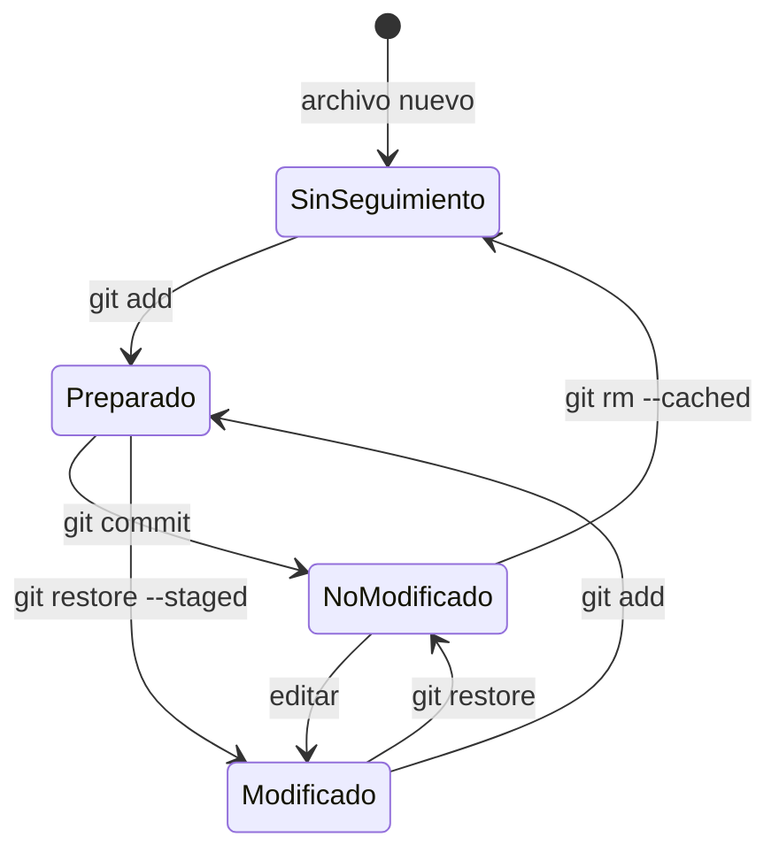
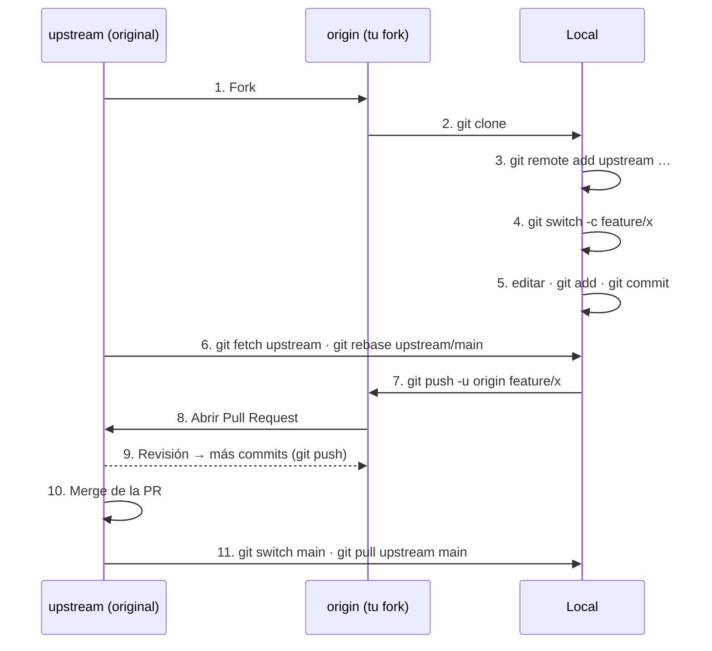

---
{"dg-publish":true,"permalink":"/optativa-desarrollo-web-full-stack/apuntes/tema-00-repaso/comandos-de-git-resumen/","title":"comandos de git resumen","tags":["clippings","git","github"],"noteIcon":"","dg-note-properties":{"title":"comandos de git resumen","source":"https://search.brave.com/search?q=comandos+de+git+resumen&source=desktop&conversation=0998e37c5438007ac159018d4e3cd14c5326","author":null,"published":null,"created":"2026-09-22","updated":"2026-09-29","description":"Resumen actualizado de comandos Git y flujo de trabajo con GitHub (fork, clone, PR), según las recomendaciones actuales de Git.","tags":["clippings","git","github"]}}
---

# Git: resumen actualizado de comandos

> [!info] Qué cambia respecto a versiones antiguas
> Desde **Git 2.23** existen `git switch` (cambiar/crear ramas) y `git restore` (deshacer cambios en archivos). La documentación oficial los recomienda frente a `git checkout`, que hacía **dos cosas muy distintas** (cambiar de rama *y* sobrescribir archivos) y era fácil perder trabajo por error. `checkout` sigue funcionando, pero ya no es la forma recomendada.

## 1. Mapa de estados y comandos

Git tiene **cuatro zonas locales** (incluyendo el stash) y, cuando usas GitHub, **uno o dos repositorios remotos**: `origin` (tu fork o el repo en el que tienes permisos) y `upstream` (el repositorio original, cuando trabajas con fork).



**Estados de un archivo** dentro del directorio de trabajo:



| Zona | Qué contiene | Cómo verla |
|---|---|---|
| Working tree | Archivos tal como los editas | `git status`, `git diff` |
| Staging | Lo que irá en el próximo commit | `git diff --staged` |
| Repo local | Historial de commits | `git log` |
| Remote-tracking | Última “foto” conocida del remoto | `git branch -r`, `git log origin/main` |
| Stash | Cambios aparcados | `git stash list` |
| Remoto | Repo en GitHub | `git remote -v` |

---

## 2. Configuración inicial

### `git config`
Guarda tu identidad y preferencias.
```bash
git config --global user.name "Tu Nombre"
git config --global user.email "tu@email.com"
git config --global init.defaultBranch main   # rama inicial "main" en vez de "master"
git config --global pull.rebase false          # o true: define qué hace git pull (ver §7)
git config --global core.editor "code --wait"  # editor para mensajes
git config --list --show-origin                # ver toda la configuración
```
**Por qué:** desde Git 2.28 se puede elegir el nombre de rama inicial; GitHub y la mayoría de proyectos usan `main`. Si no configuras `pull.rebase`, Git muestra un aviso en cada `pull` ambiguo.

- `--global`: para todos tus repos · `--local`: solo el repo actual · `--system`: toda la máquina.

---

## 3. Crear u obtener un repositorio

### `git init`
Convierte la carpeta actual en un repositorio.
```bash
git init               # en la carpeta actual
git init mi-proyecto   # crea la carpeta
git init -b main       # fija la rama inicial
```

### Fork (en GitHub, no es un comando de Git)
Copia **en tu cuenta de GitHub** un repositorio ajeno. Se usa cuando **no tienes permiso de escritura** en el repositorio original y quieres contribuir.
- Botón **Fork** en la web, o con GitHub CLI: `gh repo fork usuario/repo --clone`

### `git clone`
Descarga un repositorio remoto **a tu ordenador** (con todo su historial) y crea el remoto `origin`.
```bash
git clone https://github.com/tu-usuario/repo.git
git clone git@github.com:tu-usuario/repo.git   # por SSH (recomendado: sin contraseña)
git clone --depth 1 <url>                        # solo el último commit (rápido)
git clone -b develop <url>                       # clona y se sitúa en otra rama
```

> [!tip] Fork vs clone
> | | Fork | Clone |
> |---|---|---|
> | Dónde ocurre | En GitHub (servidor) | En tu ordenador |
> | Resultado | Un repo nuevo en tu cuenta | Una copia local |
> | Para qué | Contribuir sin permisos | Trabajar localmente con cualquier repo |
> Lo habitual es **fork → clone de tu fork**.

### `git remote`
Gestiona los repositorios remotos vinculados.
```bash
git remote -v                                           # listar
git remote add upstream https://github.com/original/repo.git
git remote rename origin github
git remote remove upstream
git remote set-url origin git@github.com:tu-usuario/repo.git
```

---

## 4. Seguimiento de cambios

### `git status`
Muestra en qué estado está cada archivo.
```bash
git status
git status -s     # formato corto
```

### `git add`
Pasa cambios del working tree al staging.
```bash
git add archivo.txt
git add .          # todo lo de la carpeta actual (incluye borrados desde Git 2.0)
git add -p         # elegir fragmento a fragmento (muy recomendable)
```
**Por qué `-p`:** permite hacer commits pequeños y coherentes, que es la práctica recomendada.

### `git commit`
Guarda lo preparado como una nueva “foto” del proyecto.
```bash
git commit -m "Añade validación de email"
git commit          # abre el editor para un mensaje largo
git commit -am "…"  # add + commit de archivos YA seguidos (no incluye nuevos)
git commit --amend  # corrige el último commit (solo si aún no lo subiste)
```
**Buenas prácticas del mensaje:** primera línea ≤ 50 caracteres en imperativo, línea en blanco y explicación del *porqué*.

### `git diff`
```bash
git diff             # working tree vs staging
git diff --staged    # staging vs último commit
git diff main..rama  # entre ramas
```

### `git log`
```bash
git log --oneline --graph --all   # vista compacta con ramas
git log -p archivo                # historial con cambios de un archivo
git log --author="Nombre" --since="2 weeks"
```

### `.gitignore`
Archivo con patrones que Git debe ignorar (`node_modules/`, `*.log`, `.env`…). Plantillas en github.com/github/gitignore.

---

## 5. Deshacer cambios (forma moderna)

| Quiero… | Comando recomendado | Antes se usaba |
|---|---|---|
| Descartar cambios de un archivo | `git restore archivo` | `git checkout -- archivo` |
| Sacar un archivo del staging | `git restore --staged archivo` | `git reset HEAD archivo` |
| Recuperar un archivo de otro commit | `git restore --source=<commit> archivo` | `git checkout <commit> -- archivo` |
| Deshacer un commit ya publicado | `git revert <commit>` | — |
| Mover la rama a un commit anterior (local) | `git reset --soft/--mixed/--hard <commit>` | — |

- `git revert` crea un commit **nuevo** que anula otro: seguro para ramas compartidas.
- `git reset` **reescribe historial**: úsalo solo en commits que no has subido. `--hard` borra cambios sin vuelta atrás fácil.
- Salvavidas: `git reflog` muestra todo lo que ha apuntado `HEAD` y permite recuperar commits “perdidos”.

---

## 6. Ramas

### `git branch`
```bash
git branch             # listar locales
git branch -a          # locales y remotas
git branch nueva       # crear (sin cambiarte)
git branch -d rama     # borrar (si ya está fusionada)
git branch -D rama     # forzar borrado
git branch -m nuevo    # renombrar la rama actual
```

### `git switch` (recomendado en lugar de `checkout`)
```bash
git switch main
git switch -c feature/login     # crear y cambiar
git switch -                    # volver a la rama anterior
git switch -c fix origin/fix    # crear rama local a partir de una remota
```

### `git merge`
Integra otra rama en la actual creando (si hace falta) un *merge commit*.
```bash
git switch main
git merge feature/login
git merge --no-ff feature/login   # fuerza merge commit (conserva la rama en el historial)
git merge --abort                 # cancelar si hay conflictos
```

### `git rebase`
Reaplica tus commits encima de otra rama → historial lineal.
```bash
git switch feature/login
git rebase main
git rebase -i HEAD~3      # interactivo: reordenar, unir (squash), editar commits
git rebase --continue | --abort
```
> [!warning] Regla de oro
> No hagas rebase de commits que otras personas ya tienen. Si debes subir una rama tuya rebasada, usa `git push --force-with-lease` (nunca `--force` a secas: `--force-with-lease` se niega si alguien subió algo que tú no tienes).

### Resolver conflictos
1. `git status` muestra los archivos en conflicto.
2. Edita las marcas `<<<<<<<`, `=======`, `>>>>>>>`.
3. `git add archivo` y después `git commit` (merge) o `git rebase --continue`.

---

## 7. Sincronización con el remoto

### `git fetch`
Descarga novedades a las ramas de seguimiento (`origin/main`) **sin tocar tu trabajo**. Es la opción más segura.
```bash
git fetch origin
git fetch --all --prune   # todos los remotos y limpia ramas borradas
```

### `git pull`
`fetch` + integrar (merge o rebase) en tu rama actual.
```bash
git pull                 # según pull.rebase
git pull --rebase        # historial lineal
git pull --ff-only       # solo si no hay divergencia (la opción más prudente)
```
**Por qué configurarlo:** desde Git 2.27 Git avisa si no has elegido estrategia, porque un merge automático inesperado ensucia el historial.

### `git push`
Sube tus commits al remoto.
```bash
git push -u origin feature/login   # primera vez: enlaza la rama local con la remota
git push                           # siguientes veces
git push --force-with-lease        # tras un rebase de TU rama
git push origin --delete rama      # borrar rama remota
git push --tags
```

### `git stash`
Aparca cambios sin commitear para cambiar de tarea.
```bash
git stash push -m "a medias"   # (`git stash save` está obsoleto)
git stash -u                   # incluye archivos sin seguimiento
git stash list
git stash pop                  # aplica y elimina
git stash apply stash@{1}      # aplica sin eliminar
git stash drop stash@{0}
```

### `git tag`
```bash
git tag -a v1.0 -m "Versión 1.0"   # etiqueta anotada (recomendada)
git push origin v1.0
```

---

## 8. Cómo hacer una Pull Request (PR)

Una **PR** es una petición en GitHub para que tus cambios de una rama se integren en otra (normalmente `main` del proyecto original). Permite revisión, comentarios y pruebas automáticas antes de fusionar.



**Paso a paso:**
```bash
# 1. Fork en GitHub (botón Fork)
# 2. Clonar TU fork
git clone git@github.com:tu-usuario/proyecto.git
cd proyecto
# 3. Enlazar el original
git remote add upstream https://github.com/original/proyecto.git
# 4. Rama por tarea (nunca trabajes directamente en main)
git switch -c feature/mejora-login
# 5. Trabajar
git add -p
git commit -m "Mejora validación del formulario de login"
# 6. Ponerte al día con el original
git fetch upstream
git rebase upstream/main
# 7. Subir la rama a tu fork
git push -u origin feature/mejora-login
# 8. En GitHub: "Compare & pull request" (o: gh pr create --fill)
```
- **Si te piden cambios:** sigue haciendo commits en la misma rama y `git push`; la PR se actualiza sola.
- **Tras el merge:** `git switch main && git pull upstream main && git push origin main` y borra la rama (`git branch -d feature/mejora-login`).
- **Sin fork** (si tienes permisos en el repo): se omiten los pasos 1 y 3; clonas el repo y haces la PR de tu rama a `main`.
- **Opciones de fusión en GitHub:** *Merge commit* (conserva todo), *Squash and merge* (un único commit, historial limpio), *Rebase and merge* (lineal, sin merge commit).

---

## 9. Chuleta rápida

| Acción                    | Comando                           |
| ------------------------- | --------------------------------- |
| Ver estado                | `git status`                      |
| Preparar                  | `git add -p`                      |
| Confirmar                 | `git commit -m "…"`               |
| Nueva rama                | `git switch -c rama`              |
| Cambiar rama              | `git switch rama`                 |
| Descartar cambios         | `git restore archivo`             |
| Quitar del staging        | `git restore --staged archivo`    |
| Traer sin mezclar         | `git fetch`                       |
| Traer y mezclar           | `git pull --ff-only`              |
| Subir                     | `git push -u origin rama`         |
| Deshacer commit publicado | `git revert <commit>`             |
| Recuperar algo perdido    | `git reflog`                      |
| Historial visual          | `git log --oneline --graph --all` |
